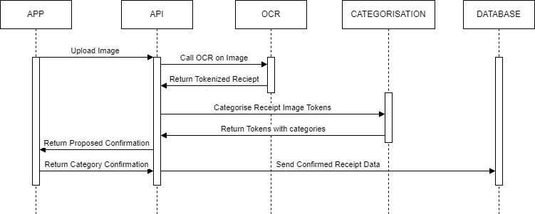

********************
Project Architecture
********************

This diagram shows the overall architecture of the deployed system. The backend of the system is deployed on a server hosted on Digital Ocean. This uses ``docker-compose`` to deploy several docker containers, each running an individual backend component. This code is deployed automatically using a GitLab pipeline running on a separate server.

   Deployment Diagram

Below is a sequence diagram, showing the process of uploading and processing a receipt:

   Sequence Diagram: Uploading a receipt

Project Components
==================

OCR
---
This module contains the code for taking an image of a receipt, performing optical character recognition
on it, and tokenising the receipt to extract individual items and their prices.

Categorisation
--------------
This module handles the categorisation of receipt items. It uses the data from the Webscraping Framework and the
Parsing Library to perform this. It operates on a list of receipt items and returns a list of the same items,
together with their category.

Parsing Library
---------------
Within this project we required preprocessing methods in two different contexts. One
being for preprocessing the raw data collected using the web scraping framework and two for
preprocessing receipt tokens (text pertaining to one item on a receipt). This library was constructed
with generality in mind and provides functionality for both these different data sources.

Webscraping Framework
---------------------
This project required large amounts of data to develop the categorisation element
therefore the web scraping framework was developed. This allow rapid implementation of
web scrapers for different retailers websites resulting in large labelled raw data-sets.

Project Repository Structure
============================

Branches
--------
All development work is centred around the ``dev`` branch. This branch is only merged to ``main`` once a stable version is reached. For the development of this project, we have followed a strategy of creating new branches to work on new features or bug fixes. When work is complete and reviewed, the branch is merged into ``dev``.

Folder Structure
----------------
::

   team33_project
   ├───tools
   │   ├───webscrapers
   │   └...
   │
   ├───frontend
   │   └...
   │
   └───backend
      ├────db
      ├────ocr
      ├────categorisation
      └────api

All code for the frontend is stored in ``frontend/``, including all ``npm`` build files. All backend code is stored in ``backend``, including deployment files such as ``Dockerfile`` s and a ``docker-compose.yml``, as well as the Python code for all backend components, which are split up into indivdirectories.

Hosting and Deployment
======================

Docker
------
The entire backend of this project has been designed for easy deployment using `Docker <https://www.docker.com/>`_. Docker Compose is used to orchestrate the creation and running of multiple containers. Four containers are used in this project:

* ``api`` - All backend Python code including the Flask server, OCR, and Categorisation.
* ``db`` - The `MariaDB <https://mariadb.org/>`_ database instance.
* ``proxy`` - `NGINX <https://www.nginx.com/>`_ operating as a reverse proxy for web requests.

   A diagram of the indivudal Docker containers and the ports they communicate on.

This means that a new instance of the server can be started by simply running ``docker compose up`` in the ``backend`` directory.

.. note::
   The ``creds.json`` file contianing the keys to access Google Cloud services must be placed in the correct location *before* building the ``api`` container.

Hosting
-------
Currently, we are using a VPS server hosted on Digital Ocean. As we have only been testing with a limited number of users, a large ammount of distributed computing power is not required and this server is perfectly adequate.

CI/CD Pipeline
--------------
We have set up a GitLab continuous integration pipeline to make development easier and more rapid. Currently, whenever any code is pushed, ``pylint`` checks are run automatically to ensure that code conforms to naming schemes, coding conventions, etc. If the code is pushed to the ``dev`` branch, it will automatically be deployed to our testing server. This is done using an ``SSH`` and ``SCP`` connection with the target server. Credentials for this are stored as secure variables in GitLab.

.. note::
   The pipeline requires a GitLab Runner to be set up and attached to the repository. Instructions for doing this can be found `here <https://docs.gitlab.com/runner/>`_.

.. include:: ocr.rst
.. include:: categorisation.rst
.. include:: parse.rst
.. include:: server.rst
.. include:: webscraping.rst
.. include:: maintenance.rst
.. include:: api-doc.rst
.. include:: frontend-software-manual.rst

